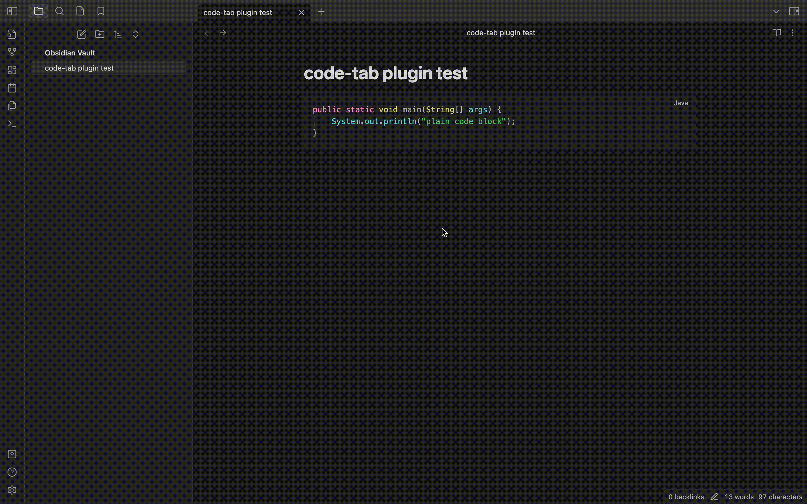
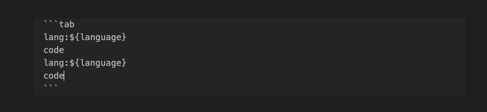

# Code Tab Plugin for Obsidian

This is a plugin allows you to insert code blocks in whatever language you want and present them in tab.

# Preview

# Use
Insert code block with syntax:

You can add tabs as many as you want.